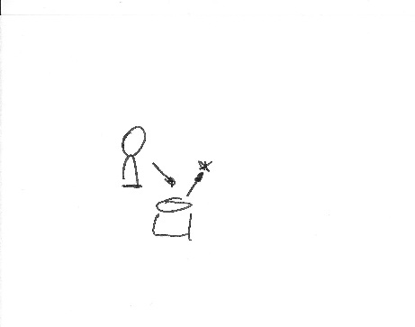
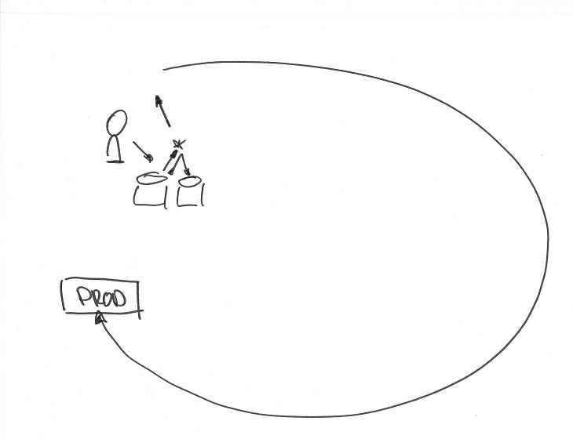
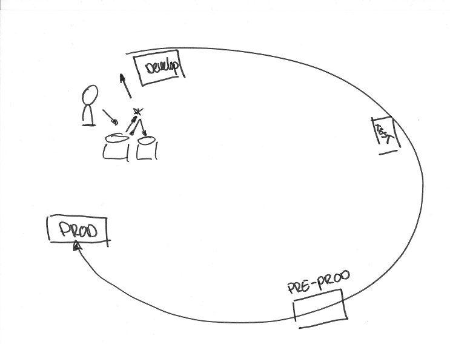
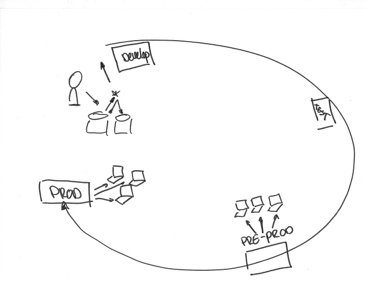

#Azure pipelines


1. create account
    * start page for azure devops services user guide https://docs.microsoft.com/en-us/azure/devops/user-guide/?view=vsts
    * Create account https://docs.microsoft.com/en-us/azure/devops/user-guide/sign-up-invite-teammates?view=vsts
    * Create a project


1. Create build for echo application windows
	- Download the code from erick repo 'git clone https://github.com/ErickSegaar/TGIF_AzurePipelines.git`
	- Push it into azure devops 
		(git remote set-url origin https://zwarebats@dev.azure.com/zwarebats/TGIF_Pipelines/_git/EchoConsole
		 git push -u origin --all)
	- Create new build from template
        - Click Use the visual designer to create a pipeline without YAML.
        
        -Continue
        
        -Save and queue`


1. Create release for echo single environment
	- create new empty release definition (Empty Job)
    - Add artifact of the build
    - Add powershell task to the first environment
    - Choose the build source ==> add
    - In stage 1 click 1job, 0 task
    - click the + button and add a powershell task
    - Click on the powershell to configure
    - choose inline with script `Write-Host "This task mimics the deployment as we won't go to azure today"`
    - Rename the Display name to `Fake deployment`
    - Right click clone the task
    - Change the new task to `Call the application`
    - Change script to `&"$(System.DefaultWorkingDirectory)/_TGIF_Pipelines-.NET Desktop-CI/drop/EchoConsole/bin/Release/EchoConsole.exe" "Hello World"`
    
    - save and run release
	- Talk about approvals


1. Change the code to use variables
	- enable CI
    Go to your CI build and choose edit, triggers and enable continuous integration
	- enable CD
		Go to your release pipeline and choose edit, and enable the lightning bolt at the artifact    
	- Go to your repos tab, echoconsole.program.cs and change the file to look like
        ```
        static void Main(string[] args)
        {
            if (args.Any())
            {
                Console.WriteLine($"Given argument {args.First()}");
            }

            Console.WriteLine(System.Configuration.ConfigurationManager.AppSettings.Get("ApplicationEnvironment"));
        }
        ```

	- Now commit your changes, with a comment `git commit -m 'changed my program with application settings'` and watch what happens, talk

1. Change release to inject pipelines for different environment
    - go to the marketplace and search & install "Replace Tokens"
	- add 2 more environments with different environment variables
    - edit the release pipeline
    - add replace tokenstep as the frist step in your first environment
    - Go back to environment overview and clone your environment 2 times (test, prod)
    - now go to your repos tab, echoconsole.app.release.config and change it to look like
	- look at the variables, explain the scoping and add a unique value for ApplicationEnvironment for each scope
        Click on variable ==> pipeline variables and add 3 variables 1 in release scope, 1 in test scope and 1 in prod scope. Give them a fancy value. and the name ApplicationEnvironment 
```
    <?xml version="1.0" encoding="utf-8"?>
    <!--For more information on using transformations see the web.config examples at http://go.microsoft.com/fwlink/?LinkId=214134. -->
    <configuration xmlns:xdt="http://schemas.microsoft.com/XML-Document-Transform">
        <appSettings>
            <add key="ApplicationEnvironment" value="#{ApplicationEnvironment}#" xdt:Transform="Replace"/>
        </appSettings>
    </configuration>

```
	- Commit and run
	- Talk about what happens

1. Explain different possibilities for releaseing, libraries, taskgroup
    - Administering one pipeline can be easy but what makes it hard is when you have hundreds
    - How can you make it easier to change multiple envrionments at once, explain versions and drafts
    - Change the pipeline to use libraries and taskgroups
    - Create a library GeneralVariables, add variable GeneralInfo with a unique value
    - Change the release to use the general varialbles library, scope release
    - change the app.release.config and add `<add key="ApplicationEnvironment" value="#{GeneralInfo}#" xdt:Transform="Insert"/>`
    - change program.cs and add `Console.WriteLine(System.Configuration.ConfigurationManager.AppSettings.Get("GeneralInfo"));`


1. Change release to use parrallelization
	- Add a variable array $(environments) with the value First, Second
	- change agent mode of the latest 2 environments to parrallelization with 2 agents and run it.
    - change the tasklibrary to call the application to `&"$(System.DefaultWorkingDirectory)/_TGIF_Pipelines-.NET Desktop-CI/drop/EchoConsole/bin/Release/EchoConsole.exe" "$(Environments)"`
	- Discuss scenario's for this mode


1. Switch to javascript, yaml and linux
    - Clone https://github.com/MicrosoftDocs/pipelines-javascript.git into a new repository
    ```
    git clone https://github.com/MicrosoftDocs/pipelines-javascript.git
    git remote set-url origin https://zwarebats@dev.azure.com/zwarebats/TGIF_Pipelines/_git/xxx
    git push -u origin --all
    ```
    - Create a new build definition, this time use the yaml one. Use the azure repo, next next finish. It will detect the yaml in the project

1. Let's try to use 1 build for all your branches, when a branch comes from a feature branch it cannot be deployed automatically but only manual and only master can go past your test environment

Done?

1. Create tokens
	- create token with right scope
	- explain system and PAT tokens

1. Change build for web application to Private Linux
	- Run the docker container with private agent, attached to your public azure devops
	- change to the new queue with the private agent
	- change up the container to get a extra layer for an environment variable
	- run another private agent with the new container
	- force the build to the later agent
	- Talk about scenario to use private agents, directing build capabilities, how this can be cool with k8s pods and scale

1. Run Smoke test?
    - include smoketest for the validation of the environment variables
    - talk about the importance       
